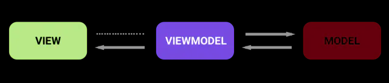
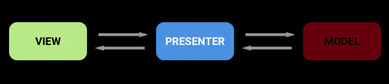

1. mvvm
   - view事件驱动，比如点击事件
   - ViewModule.func()
   - view module下的livedata实例LiveData.setValue()
   - LiveData.dispatchingValue()
   - 遍历LiveData.mObservers并调用considerNotify(ObserverWrapper)
   - Observer.onChanged(T t)
   - view相应值的变化
   
2. mvp
   
   - 
   - 
   - 