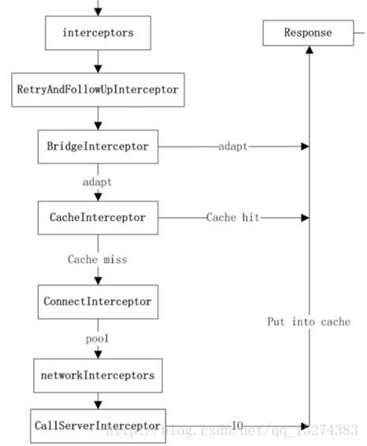
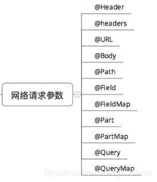

1. 添加引用
   ```gradle
    implementation 'com.squareup.okhttp3:okhttp:4.9.0'
    implementation 'com.squareup.retrofit2:retrofit:2.9.0'
    implementation 'com.squareup.retrofit2:adapter-rxjava3:2.9.0'
    implementation 'com.squareup.retrofit2:converter-gson:2.9.0'
   ```
2. 创建实例
   ```
    new Retrofit.Builder()
                .baseUrl(baseUrl)
                .addConverterFactory(GsonConverterFactory.create()) //添加gson数据转换器
                .addCallAdapterFactory(RxJava3CallAdapterFactory.create()) //请求方式变成rxjava风格
                .build();
   ```
3. api service
   ```
   @GET("cgi-bin/token")
    Observable<AccessTokenEntity> token(@Query("grant_type") String grantType ,@Query("appid") String appId,@Query("secret") String secret); 
   ```

   通过动态代理生产接口实例
   ```
   Proxy.newProxyInstance(
            service.getClassLoader(),
            new Class<?>[] {service},
            new InvocationHandler() {
              private final Platform platform = Platform.get();
              private final Object[] emptyArgs = new Object[0];

              @Override
              public @Nullable Object invoke(Object proxy, Method method, @Nullable Object[] args)
                  throws Throwable {
                // If the method is a method from Object then defer to normal invocation.
                if (method.getDeclaringClass() == Object.class) {
                  return method.invoke(this, args);
                }
                args = args != null ? args : emptyArgs;
                return platform.isDefaultMethod(method)
                    ? platform.invokeDefaultMethod(method, service, proxy, args)
                    : loadServiceMethod(method).invoke(args);
              }
            });
   ```

   调用方法处判断如果是自定义的方法则调用loadServiceMethod并缓存service方法。
   ```
       ServiceMethod<?> loadServiceMethod(Method method) {
        ServiceMethod<?> result = serviceMethodCache.get(method);
        if (result != null) return result;
    
        synchronized (serviceMethodCache) {
          result = serviceMethodCache.get(method);
          if (result == null) {
            result = ServiceMethod.parseAnnotations(this, method);
            serviceMethodCache.put(method, result);
          }
        }
        return result;
      }
   ```
   解析service method的方法在ServiceMethod下的一个静态方法ServiceMethod.parseAnnotations
   RequestFactory.parseAnnotations主要是解析注解的基本信息（用到了builder模式）。
   HttpServiceMethod.parseAnnotations(retrofit, method, requestFactory)则返回解析好的方法信息，用到了构造器那里设置的call adapter和response converter
   ```
    CallAdapter<ResponseT, ReturnT> callAdapter =
        createCallAdapter(retrofit, method, adapterType, annotations);
    Type responseType = callAdapter.responseType();
    
    ...
    
     Converter<ResponseBody, ResponseT> responseConverter =
        createResponseConverter(retrofit, method, responseType);
   ```

   调用service方法时触发service invoke，生成一个okhttp call，然后调用HttpServiceMethod的一个子类CallAdapted处理事务
   ```
    Call<ResponseT> call = new OkHttpCall<>(requestFactory, args, callFactory, responseConverter);
    return adapt(call, args);
   
   ...
   
    protected ReturnT adapt(Call<ResponseT> call, Object[] args) {
      return callAdapter.adapt(call);
    }
   ```
4.  HttpServiceMethod包含3个子类分别是CallAdapted、SuspendForResponse和SuspendForBody。CallAdapted通过adapt方法调用calladapter的adapt方法，后面两个用到KotlinExtensions暂时没看。
5.  rxjava3calladapter adapt方法，获取response
    ```
    Observable<Response<R>> responseObservable =
        Observable<Response<R>> responseObservable =
        isAsync ? new CallEnqueueObservable<>(call) : new CallExecuteObservable<>(call);isAsync ? new CallEnqueueObservable<>(call) : new CallExecuteObservable<>(call);
    ```
    CallEnqueueObservable方法调用call.enqueue(callback);CallExecuteObservable调用call.execute()。
6. Call的实现类OkHttpCall，createRawCall创建一个RealCall，RealCall.execute()，通过 client.dispatcher.executed(this)添加到队列；
    然后InterceptorChain获取response;
7. 
   - RetryAndFollowUpInterceptor,This interceptor recovers from failures and follows redirects as necessary.
   - BridgeInterceptor,Bridges from application code to network code. First it builds a network request from a user request. Then it proceeds to call the network. Finally it builds a user response from the network response.
   - CacheInterceptor,Serves requests from the cache and writes responses to the cache.
   - ConnectInterceptor,Opens a connection to the target server and proceeds to the next interceptor. The network might be used for the returned response, or to validate a cached response with a conditional GET.
   - OkHttpClient.interceptors,
   - OkHttpClient.networkInterceptors,
   - CallServerInterceptor,This is the last interceptor in the chain. It makes a network call to the server.
8. 
9. retrofit interface @Field标签需要跟@FormUrlEncoded一起使用


